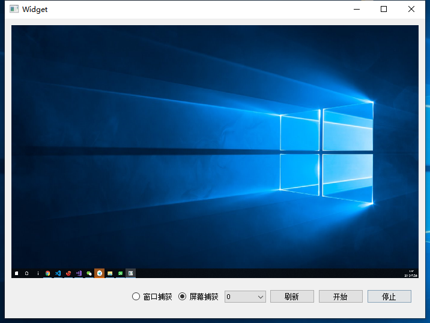

[TOC]

# learn_webrtc
学习webrtc，基于webrtc native开发音视频工具

# example展示
## 桌面捕获

# 环境要求
## win
- 可以科学上网（首要前提）
- git
- vs2017（安装了ATL、MFC和Windows 10 SDK）
    win10 sdk需要安装了Debugging Tools For Windows，没有安装的话

    进入 控制面板\程序\程序和功能，选择Windows Software Development Kit，右键更改，选择Change，勾选Debugging Tools For Windows，点击Change

# 编译步骤
## win
- 执行syc_for_win.bat同步webrtc代码(开发过程只需同步一次即可)
- 执行build_for_win.bat编译（需要修改脚本中GYP_MSVS_OVERRIDE_PATH变量为你的vs2017的路径（后面改用更加灵活的方式））