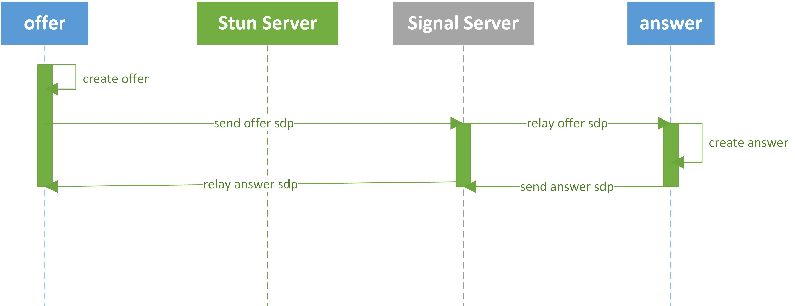
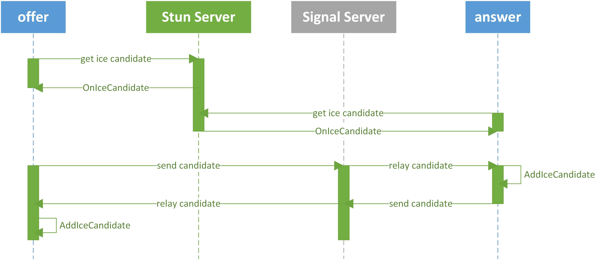
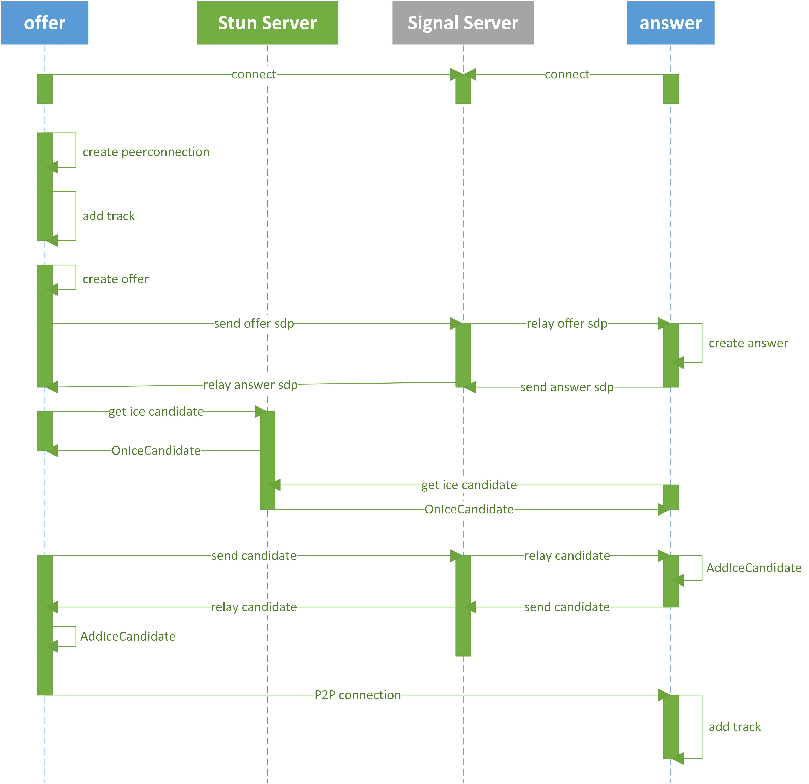

# 简介
webrtc是基于P2P的，所以P2P是webrtc的精髓，而PeerConnection是实现P2P的核心接口。

PeerConnection表示一个P2P连接其中的一端(Peer)，我们接下来编程最常使用的都是PeerConnection的接口，它包含了建立p2p连接所需要的所有功能，主要包括设置sdp、创建ice通道、传输媒体数据，传输普通数据等。

# 基础知识
要建立一个P2P连接，并在其上传输媒体数据，我们需要两个端（offer端和answer端）互相交换以下信息：

1. SDP：媒体会话描述信息，包括分辨率和编码格式等，用来协调匹配两个Peer的媒体编解码等信息
2. IceCandidate：ICE相关信息，包括候选地址、网络连接情况等，用来实现NAT穿透

webrtc用于实现以上信息交换的C++ API就是PeerConnectionInterface。

## SDP信息的交换
为了完成SDP信息的交换，我们先在offer端用PeerConnectionInterface::CreateOffer()方法创建一个offer，offer创建成功以后会触发CreateSessionDescriptionObserver::OnSuccess回调，回调参数是SessionDescriptionInterface，首先我们在offer端使用PeerConnectionInterface::SetLocalDescription设置本地sdp，然后将SessionDescriptionInterface转为字符串通过signal server传送给answer端，answer端收到SDP后，将字符串SDP转换为SessionDescriptionInterface，在answer端调用PeerConnectionInterface::SetRemoteDescription来设置远端SDP，然后answer端调用PeerConnectionInterface::CreateAnswer来创建一个answer，answer创建成功以后同样会触发CreateSessionDescriptionObserver::OnSuccess回调，回调参数依然是SessionDescriptionInterface，首先我们在answer端使用PeerConnectionInterface::SetLocalDescription设置本地sdp，然后将SessionDescriptionInterface转为字符串通过signal server传送给offer端，offer端收到SDP后，将字符串SDP转换为SessionDescriptionInterface，在offer端调用PeerConnectionInterface::SetRemoteDescription来设置远端SDP。所以总结来说，通信的双方通过调用setLocalDescription() 方法，把自己生成的 SDP 设置成本地描述；通过调用setRemoteDescription() 方法，把对方发给自己的 SDP 设置成远程描述。以上的这个过程，被统称为JSEP（JavaScript Session Establishment Protocol，JavaScript 会话建立协议）。

来个时序图更加直观：

## IceCandidate信息交换
IceCandidate信息交换是通过ICEInteractive Connectivity Establishment，交互式连接建立）完成的。对于P2P连接最简单的设想是，大家都连接在一个网络中，只要双方都知道对方的IP地址，我就可以直接发送数据。但现实永远不会这么简单：如今的网络世界中，绝大部分设备并不是直接连接到互联网上，具有一个公网IP地址，而是处在层层的路由器和防火墙的背后，这也就使得直接建立连接变得不可能。不过，如果双方都向一个公网上的服务器发送一个请求，这台服务器可以获取到双方的公网地址，这样就可以让双方知晓怎样和对方进行通讯。这就是STUN 服务器。

当offer和answer完成了SDP信息的交换后，PeerConnectionInterface便利用STUN服务器收集ICE候选（IceCandidate），也就是双方建立连接的多个可能途径，然后在这些候选中挑选最优化的一个，用以建立P2P连接。

在代码中，当ICE候选（IceCandidate）收集完成以后（offer端是在调用PeerConnectionInterface::CreateOffer()以后开始收集，answer端是在调用PeerConnectionInterface::CreateAnswer以后开始收集），我们会收到PeerConnectionObserver::OnIceCandidate回调，回调参数为IceCandidateInterface，我们将IceCandidateInterface转为字符串形式发送给对端，对端收到后转换为IceCandidateInterface，调用 PeerConnectionInterface::AddIceCandidate来添加，两端都添加完毕之后，IceCandidate信息交换完成。

STUN还有一个扩展，即TURN服务器。除了实现STUN的全部功能外，当双方由于某种原因（如防火墙）还是没法建立点对点连接时，TURN服务器可以起到中转的作用，让双方可以绕过防火墙进行通讯（事实上绝大多数防火墙被配置为允许从内部向外主动发起的连接）。

下面是IceCandidate信息交换的时序图：

# PeerConnection建立连接流程

上述序列中，WebRTC并不提供Stun服务器和Signal服务器，服务器端需要自己实现。Stun服务器可以用google提供的实现stun协议的测试服务器（stun:stun.l.google.com:19302），Signal服务器则完全需要自己实现了，它需要在offer和answer之间传送彼此的SDP信息和candidate信息，offer和answer通过这些信息建立P2P连接来传送音视频数据。由于网络环境的复杂性，并不是所有的客户端之间都能够建立P2P连接，这种情况下就需要有个relay服务器做音视频数据的中转，这里就不考虑了。这里说明一下， stun/turn、relay服务器的实现在WebRTC源码中都有示例，真是个名副其实的大宝库。

上述序列中，标注的场景是offer向answer发起对聊请求，调用描述如下：

- offer首先创建PeerConnection对象，然后打开本地音视频设备，将音视频数据封装成Track添加到PeerConnection中。
- offer调用PeerConnection的CreateOffer方法创建一个用于offer的SDP对象，SDP对象中保存当前音视频的相关参数。offer通过PeerConnection的SetLocalDescription方法将该SDP对象保存起来，并通过Signal服务器发送给answer。
- answer接收到offer发送过的offer SDP对象，通过PeerConnection的SetRemoteDescription方法将其保存起来，并调用PeerConnection的CreateAnswer方法创建一个应答的SDP对象，通过PeerConnection的SetLocalDescription的方法保存该应答SDP对象并将它通过Signal服务器发送给offer。
offer接收到answer发送过来的应答SDP对象，将其通过PeerConnection的SetRemoteDescription方法保存起来。
- 在SDP信息的offer/answer流程中，offer和answer已经根据SDP信息创建好相应的音频Channel和视频Channel并开启Candidate数据的收集，Candidate数据可以简单地理解成Client端的IP地址信息（本地IP地址、公网IP地址、Relay服务端分配的地址）。
- 当offer收集到Candidate信息后，PeerConnection会通过OnIceCandidate接口给offer发送通知，offer将收到的Candidate信息通过Signal服务器发送给answer，answer通过PeerConnection的AddIceCandidate方法保存起来。同样的操作answer对offer再来一次。
- 这样offer和answer就已经建立了音视频传输的P2P通道，answer接收到offer传送过来的音视频流，会通过PeerConnection的OnAddTrack回调接口返回一个标识offer端音视频流的MediaStreamTrackInterface对象，在answer端渲染出来即可。同样操作也适应answer到offer的音视频流的传输。

