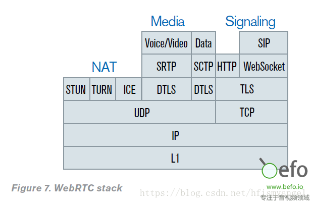
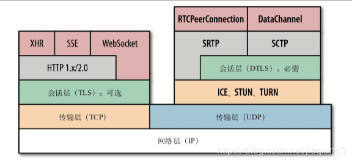
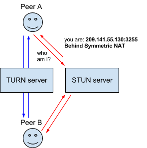

介绍一下webrtc涉及到的网络协议，主要协议如下所示：

来个带颜色的图：

下面来分别介绍

# UDP
UDP是传输层协议，我们并不陌生。webrtc中的音视频传输、DataChannel中的数据传输，都是基于UDP的。

WebRTC实时通信传输音视频的场景，讲究的是实时，当下，处理音频和视频流的应用一定要补偿间歇性的丢包，所以实时性的需求是大于可靠性的需求的。

如果使用TCP当传输层协议的话，如果中间出现丢包的情况，那么后续的所有的包都会被缓冲起来，因为TCP讲究可靠、有序；而UDP则正好相反，它只负责有什么消息我就传过去，不负责安全，不负责有没有到达，不负责交付顺序，这里从底层来看是满足WebRTC的需求的，所以WebRTC是采用UDP来当它的传输层协议的。

当然这里UDP只是作为传输层的基础，想要真正的达到WebRTC的要求，我们就要来分析在传输层之上，WebRTC做了哪些操作，用了哪些协议，来达到WebRTC的要求了。

# ICE
交互式连接建立[Interactive Connectivity Establishment (ICE)](http://en.wikipedia.org/wiki/Interactive_Connectivity_Establishment) 是一个允许你的浏览器和对端浏览器建立连接的协议框架。在实际的网络当中，有很多原因能导致简单的从A端到B端直连不能如愿完成。这需要绕过阻止建立连接的防火墙，给你的设备分配一个唯一可见的地址（通常情况下我们的大部分设备没有一个固定的公网地址），如果路由器不允许主机直连，还得通过一台服务器转发数据。ICE通过使用以下几种技术完成上述工作。

# NAT
网络地址转换协议[Network Address Translation (NAT)](http://en.wikipedia.org/wiki/NAT) 用来给你的（私网）设备映射一个公网的IP地址的协议。一般情况下，路由器的WAN口有一个公网IP，所有连接这个路由器LAN口的设备会分配一个私有网段的IP地址（例如192.168.1.3）。私网设备的IP被映射成路由器的公网IP和唯一的端口，通过这种方式不需要为每一个私网设备分配不同的公网IP，但是依然能被外网设备发现。

一些路由器严格地限定了部分私网设备的对外连接。这种情况下，即使STUN服务器识别了该私网设备的公网IP和端口的映射，依然无法和这个私网设备建立连接。这种情况下就需要转向TURN协议。

# STUN
NAT的会话穿越功能[Session Traversal Utilities for NAT (STUN)](http://en.wikipedia.org/wiki/STUN)(缩略语的最后一个字母是NAT的首字母)是一个允许位于NAT后的客户端找出自己的公网地址，判断出路由器阻止直连的限制方法的协议。

客户端通过给公网的STUN服务器发送请求获得自己的公网地址信息，以及是否能够被（穿过路由器）访问。

# TURN
一些路由器使用一种“对称型NAT”的NAT模型。这意味着路由器只接受和对端先前建立的连接（就是下一次请求建立新的连接映射）。

NAT的中继穿越方式[Traversal Using Relays around NAT (TURN)](http://en.wikipedia.org/wiki/TURN) 通过TURN服务器中继所有数据的方式来绕过“对称型NAT”。你需要在TURN服务器上创建一个连接，然后告诉所有对端设备发包到服务器上，TURN服务器再把包转发给你。很显然这种方式是开销很大的，所以只有在没得选择的情况下采用。

# SDP
会话描述协议[Session Description Protocol (SDP)](http://en.wikipedia.org/wiki/Session_Description_Protocol) 是一个描述多媒体连接内容的协议，例如分辨率，格式，编码，加密算法等。所以在数据传输时两端都能够理解彼此的数据。本质上，这些描述内容的元数据并不是媒体流本身。

# TLS
传输层安全性协议（[Transport Layer Security](https://baike.baidu.com/item/TLS/2979545?fr=aladdin)），用于加密，保证传输安全，TLS是建立在传输层TCP协议之上的协议，服务于应用层，它的前身是SSL（Secure Socket Layer，安全套接字层），它实现了将应用层的报文进行加密后再交由TCP进行传输的功能。

# DTLS
DTLS([Datagram Transport Layer Security](https://baike.baidu.com/item/DTLS/8654469?fr=aladdin))即数据包传输层安全性协议。TLS不能用来保证UDP上传输的数据的安全，因此Datagram TLS试图在现存的TLS协议架构上提出扩展，使之支持UDP，即成为TLS的一个支持数据包传输的版本。

# SCTP
SCTP 流传输控制协议[Stream Control Transmission Protocol](https://blog.csdn.net/wuxing26jiayou/article/details/79743683)，用于保证数据完整性，传输协议，在TCP/IP协议栈中所处的位置和TCP、UDP类似，兼有TCP/UDP两者特征。

# SRTP
SRTP，即安全实时传输协议([Secure Real-time Transport Protocol](https://blog.csdn.net/thinkerleo1997/article/details/80233530))，其是在实时传输协议(Real-time Transport Protocol)基础上所定义的一个协议，旨在为单播和多播应用程序中的实时传输协议的数据提供加密、消息认证、完整性保证和重放保护。

# 总结
webrtc是基于p2p的，由于NAT的存在，两个peer想要建立连接需要基于ICE框架，ICE中建立两个peer的连接主要基于STUN、TURN等协议。

webrtc建立连接后，音视频传输和DataChannel传输数据都是基于UDP协议，但是UDP是不安全的，不可靠的，所以加了一层DTLS来加密保证安全，DataChannel数据传输要求可靠性，所以使用SCTP来保证数据可靠；音视频数据不要求可靠，但是需要使用安全实时传输协议SRTP对音视频进行加密。

webrtc的信令协议一般是基于TCP的，为了保证安全，一般加一层TLS。实际应用场景中，一般使用更上层的协议，例如http/https/websocket等。

## 对于音视频数据，是有DTLS和SRTP两层加密吗？为什么不能仅仅是DTLS+RTP？它们是如何协作的？
[参考文档一](https://www.jianshu.com/p/50605466c039)

[参考文档二](https://www.cnblogs.com/lanyuliuyun/p/8289306.html)

