# 引言
近年来，直播竞答、网络游戏直播等新的实时音视频通讯场景不断推陈出新，并成为引领互联网娱乐风向的弄潮儿。实时音视频应用的爆发，也使得WebRTC（Web Real-Time Communication，网页实时通信技术，）技术成为了人们关注的焦点。如何打造自己的WebRTC 服务器呢？下面我先来介绍一下WebRTC 服务器的一些基本内容：

- 开源的WebRTC 服务器介绍
- WebRTC服务端整体分析
- 通信优化
- WebRTC的未来展望

首先，我们会先来了解下一些开源的服务器是怎么做的，我们做事情，在没有头绪的基础上，参考和模仿可能是一种必然流程，毕竟站在巨人的肩膀上，我们的视野才更加开阔。

其次，通过形形色色的开源服务器介绍和理解，我们初步的去分析一个WebRTC 服务器究竟包含哪些模块，又是一个什么样的组织架构和层次关系。后面在服务器搭建后面临的丢包和多人通话问题又有什么解决方式。最后就是展望一下整个WebRTC未来发展。

# 开源的WebRTC 服务器介绍
我们进入第一部分：WebRTC开源服务器介绍,这个模块我选择了我认为很有代表意义的3种类型的WebRTC开源服务器

## 大而全的Kurento
之所以称Kurento为大而全，是因为Kurento 强大的滤镜和计算机视觉，我们看这张图：

通过这张图我们了解到Kurento不仅仅包含了普通流媒体服务器的SFU MCU Transcoding  Recording等基本功能，还包含了强大的滤镜和计算机视觉处理功能，而且，在整体的功能上不仅仅包含WebRTC 模块还有很多其他协议支持，诸如SIP RTMP RTSP 等协议，更准确的说Kurento 更像是一个融合通信平台，而且Kurento,基于插件式编程方式，很容易扩展自己的功能模块。

Kurento 在应用中有哪些问题，或者说，哪些是优势，哪些是劣势呢，我们看下面：
### 优势：
- 文档齐全无论API使用文档,还是部署文档都很齐全
- 功能强大，强大的路径和计算机视觉处理
- 模块化编程，方便扩展，这是对开发者很友好的地方
- 使用方便，客户端服务端都有专门的API 组件 接入系统，而且服务器端提供了J2EE node.js两种接口文档，覆盖很齐全

### 劣势:
- 代码太多太庞大，可能需要开发者有足够的功力才能驾驭这把屠龙刀
- 还一个重要原因就是性能比较差

## 小而美的Mediasoup
Mediasoup是一个很新的WebRTC服务器，专注WebRTC 的相关功能开发，专注做好这一件事，很小确很美。下面这样图是Mediasoup 大致的一个基本架构图：
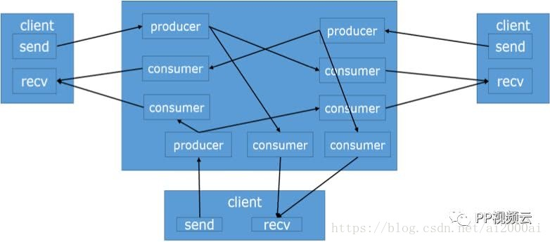

### 优势：
- 性能优秀
- 支持很多的WebRTC 新特性（PlanB  UnifiedPlan simulcast）
- 同时支持ORTC和WebRTC 的互通

### 劣势：
- 功能比较少
- 代码和架构相对来比较晦涩一点
- 信令模块只提供node.js版本

## 务实主义的Licode
说了两款极端的WebRTCserver ，我们最后讲一个务实主义的Licode ，为什么称Licode 为务实主义？Licode 这款服务器完全是站在一个PAAS 平台，一个业务的角度去思考问题，去构建整个系统，很务实，很实际，我们看Licode架构图：
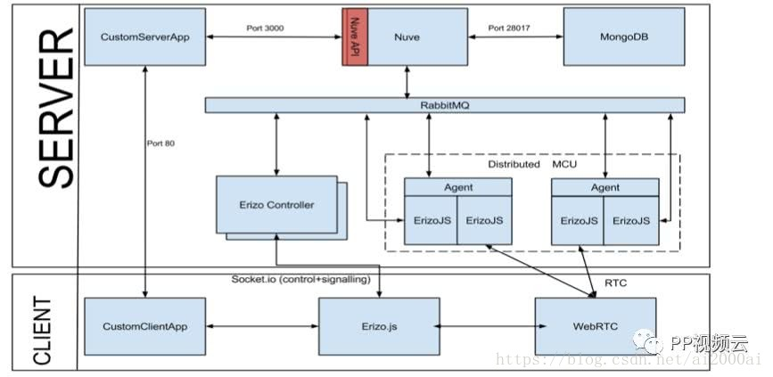

架构很清晰:

- 用户端:
    - 房间信令模块
    - WebRTC媒体模块
- 服务端：
    - 开发者方面：
        - 业务接入的API模块
    - 服务器内部：
        - 面向开发的API 服务模块，提供基本的房间和用户操作
        - 房间服务器模块,提供基本的房间信令支持
        - 媒体模块，完成服务端的WebRTC 媒体功能

整个服务架构内部各个服务模块通过MQ 消息总线进行数据通信，做了一个服务器要做的基本功能，同时微服务化，很符合现在服务器开发的方向。

### 优势：
- 功能齐全扩展方便，鉴权，存储，融合通信一应俱全
- 代码扩展简单，预留了足够的扩展接口
- 部署简单，一键脚本安装，很方便

### 缺点：
- 内部模块说明比较少
- 性能一般
- 服务端只提供的node.js 版本

## 总结
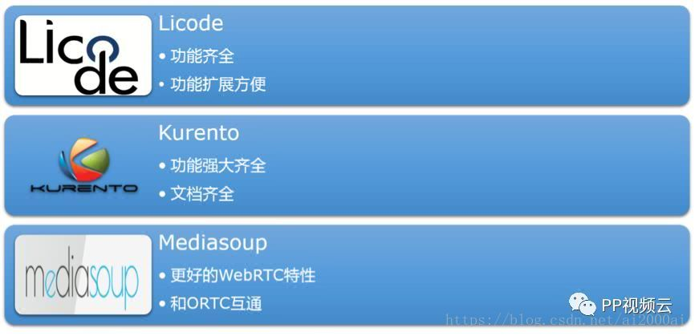
这么多服务器怎么选择呢？看自己的业务需求，团队能力，项目周期。
有能力的团队可以尝试选Kurento，讲求平衡快速选择Licode，追求极致Mediasoup 很符合选择

# WebRTC 服务端分析
前面我们讲了很多开源WebRTC服务器，到底WebRTC 是个什么东西，又包含哪些模块呢，我们从下面几个方面逐一分析：

## 基本组件
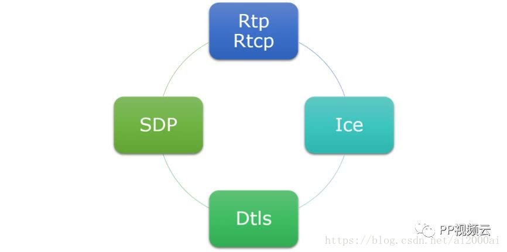

图中我列出了基本的组件：
- Rtp/Rtcp 媒体传输协议
- Dtls UDP加密协议
- ICE P2P协议
- SDP 会话描述协议，协商媒体会话

Rtp/Rtcp Dtls ICE是基本组件相对实现比较容易，这个我们不做过多介绍，我们着重介绍下SDP 这个协议

### SDP演进
SDP 伴随着WebRTC 的发展，经历了很多变化，我把这个过程归纳为两个阶段：

- PlanA

    每个stream 对应一个peer 多个stream 对应多个peer,整体运行图如下：
    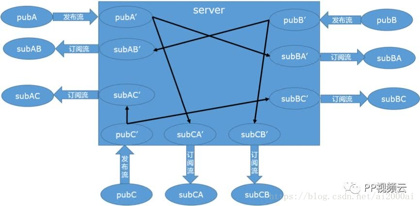

    下面是PlanA 的SDP 结构：
    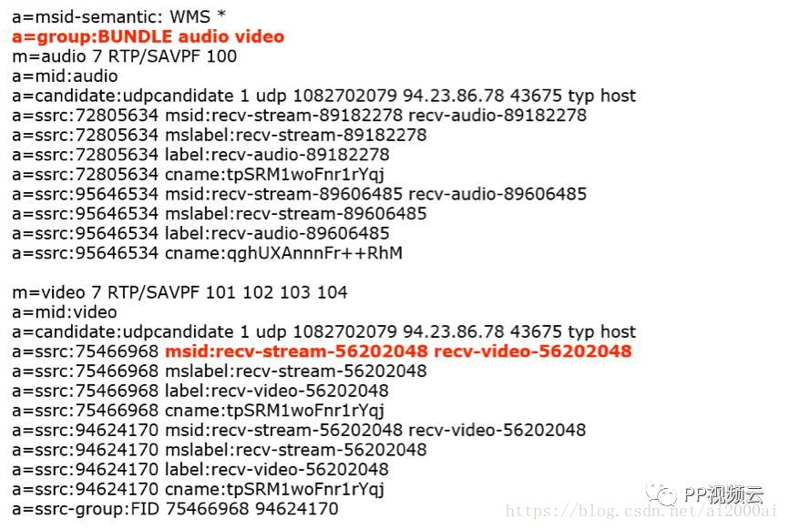

- PlanB

    one peer multi stream， 单个peer 可以拥有多个steam ，整体运行图如下：
    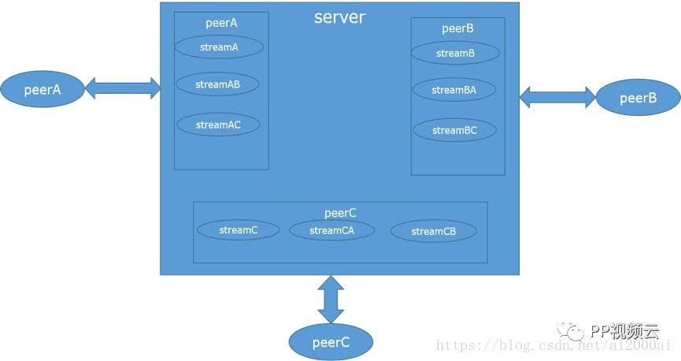

    其中PlanB 是chrome SDP 多流方案，而UnifiedPlan是Firefox 的多流标准同时也是JSEP的标准多流方案，所以UnifiedPlan是我们关注的重点。

    我们先来看看PlanB 的多流SDP 大致内容：
    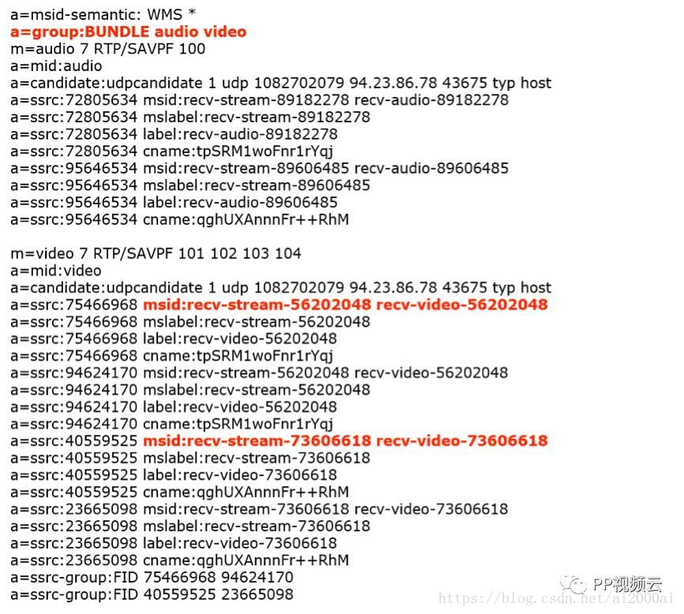

    PlanB 和 PlanA 相比，基本组织形式是相同的。我们看标红的地方，PlanB 组织多流的方式是通过msid来完成，每个msid 对应一条媒体流. 每个msid下面是自己的传输信息，所以在PlanB 方案下，我们可以通过msid来标记用户。

- UnifiedPlan

    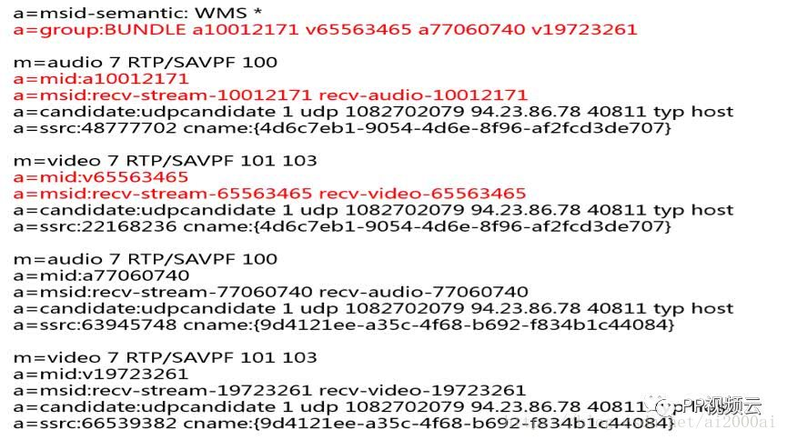

    UnifiedPlan通过加多个m 标签，来组织多流，每条流分配一个m 标签，后面跟着自己的attribute 描述，另外group 行业进行了修改，以每个track 进行描述。当然UnifiedPlan 里面也是msid 可以用来标记用户。

    相比 PlanB,UnifiedPlan SDP更加清晰，自然，当然问题是数据量比计较大，因为有很多冗余字段，当然作为JSEP 的标准，我们必须更加关注UnifiedPlan 方案。另外Firefox 里面mid 长度不能超过16位，在大家的服务器上产生UnifiedPlan 格式的SDP时注意一下。
    
    PlanBUnifiedPlan 方案优势：

        - 客户端single peer， 减少开发难度，无论 MCU 模式还是SFU 模式，客户端只需要创建一个peer

        - 减少端口占用，加强系统安全

# WebRTC 层次架构

## 接口层
接口层主要为PeerConnectionInterface接口实现，主要提供诸如一下内容：
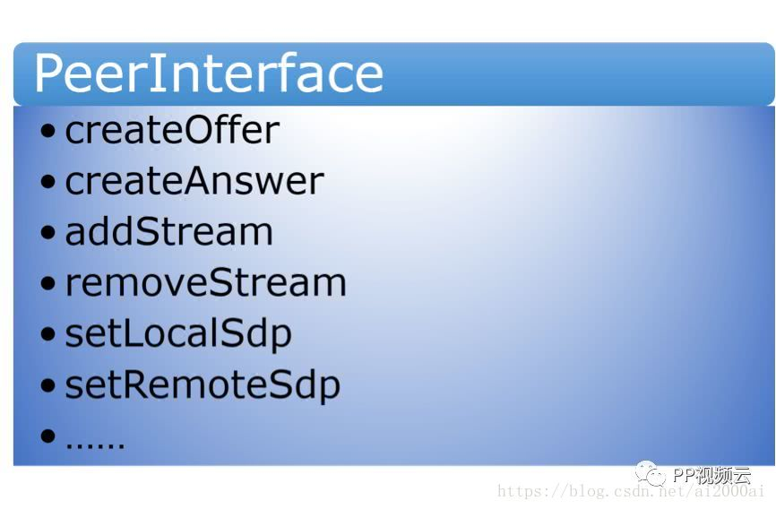

## 控制层
控制层也就是我们所说的SDP 模块，控制整个系统的运行表现，包括编解码参数，流控方式，Dtls 加解密参数以及ICE穿透用的地址候选。
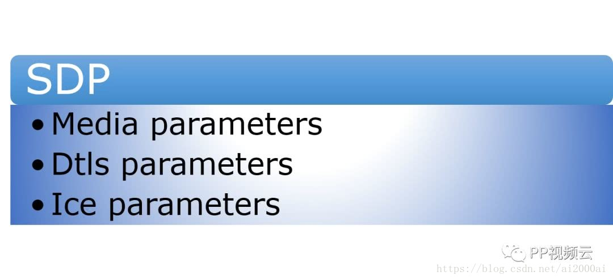

## 传输层
传输层分为3个层次，媒体打包（RTP/RTCP）,数据安全（DtlsTransport）,Ice P2P 传输模块（IceTransport）。
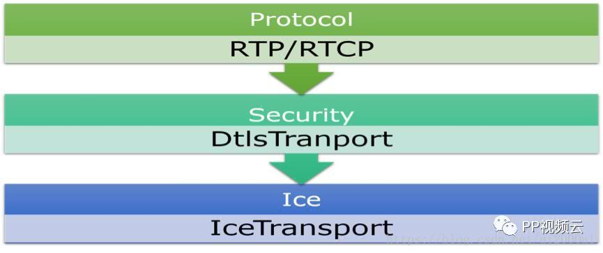

这里我们了解全部系统组件，将系统组件叠加,我们就得到了，下面是一个完整的WebRTC 组件的一个层次结构：
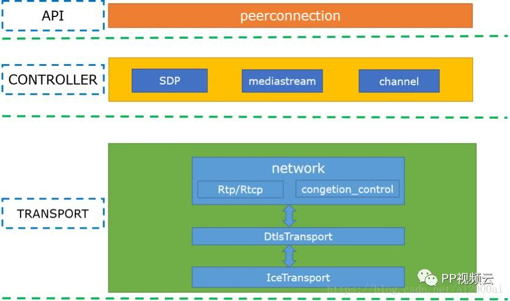

分为3层：接口层，提供基本的peer 接口功能，控制层，主要是SDP 的解析和生成工作，最后传输层，提供媒体打包，传输，流控，安全，ICE 等功能。

# WebRTC 来展望
 
## 为AI 赋能
AI 的发展，赋予了WebRTC更多的应用空间，比如基于人脸和语音识别的网站和APP 登录系统，前端通过WebRTC 进行视频数据的采集和传输，后台通过AI智能分析比对结果，进而完成登录，简单，方便。

## 安防领域
我们知道安防领域比较多的协议包括ONVIF,GB28181 RTSP，这几个协议在网页端无法直接观看，智能借助于插件，插件面临兼容和安全问题，体验很差，有的摄像头支持RTMP观看，但是很遗憾，2020年flash 将退出历史舞台，HLS延时大，而无插件，极速都是WebRTC 的优势所在，我相信不救的将来WebRTC 在安防领域会占据一席之地。

 
# 结语
WebRTC1.0 已经定稿，这为WebRTC的未来发展提供了方向，并且WebRTC 无论是应用还是社区都处于高速发展状态，并且Google也在不断地提供和完善WebRTC 的相关功能，我相信WebRTC 的未来无可限量。

# 参考资料
[如何打造自己的WebRTC 服务器](https://blog.csdn.net/ai2000ai/article/details/80705410)

[选择开源 WebRTC 媒体服务器架构的十二条建议](https://blog.csdn.net/u014228934/article/details/103023415)

[谁是最好的webrtc SFU](https://blog.csdn.net/vn9PLgZvnPs1522s82g/article/details/83543056)