大家好，我是来自百家云的陈聪，今天我将为大家带来与Licode的WebRTC全球分布式架构相关的技术分享。之所以想为大家介绍这个架构，是因为我在使用WebRTC开源服务器时发现WebRTC并没有提供类似于分布式或集群的整体解决方案，希望百家云在此领域的探索能为大家带来有价值的帮助。

# SFU
## SFU简介
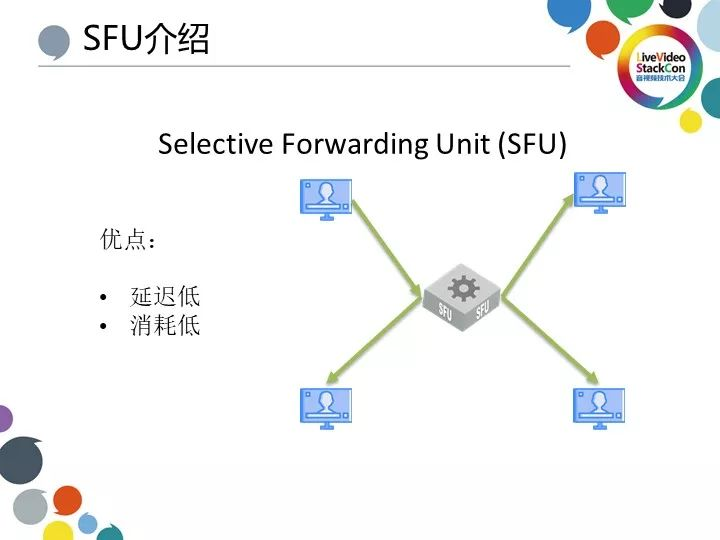

SFU全称为Selective Forwarding Unit，我们可以将其原理简单理解为将一条流推给多个端并且在整个过程中不对视频进行编解码处理。相对于其他传统的需要重新编解码的解决方案而言，其优点在于低延迟、低消耗。当然，单SFU的缺点也显而易见。

## 单SFU问题
1. 人数限制
    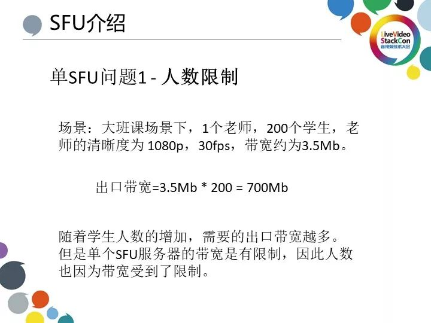
    
    单SFU面临的第一个问题是人数限制，主要出现在像“双师课堂”这种较为常见的教育场景中。在此场景中，一位老师为多名学生教学，多名学生接收由老师端发送的流。有时在“双师课堂”中容易出现老师端码率较高的情况，以1080p、30FPS的情形为例，此时一位学生所需带宽为3.5MB；如果有两百位学生在线观看则单个服务器的出口带宽就会达到700MB左右，并且随着学生人数的增加，所需出口带宽越来越多；而单个SFU的带宽是有限制的，如我们常用的阿里云、腾讯云的带宽在300～500MB左右。由于单个服务器的带宽限制，单节课同时在线人数便无法达到一个较为理想的规模。

2. 地理分布，就近接入
    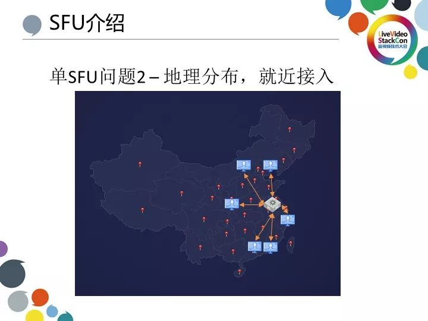
    
    地理分布与就近接入是我们在探索单SFU中面临的第二大问题，此问题主要出现在“小班课”的教育场景。虽然与“双师课堂”相比“小班课”在人数上没有那么大的规模，一般情况下一节课在线人数为6～15人，但由于在此场景中老师与学生的地理跨度较大，也许分布在世界各地。这就使得我们必须选择质量高扩展广的服务器作为接入点。可由于单SFU的原因，我们只能选用相对于所有用户较好的服务器，如上图我们选用上海的服务器。但这也导致距离服务器较远位置的用户相对于服务器所在地的用户其感受到的延迟更为明显。

    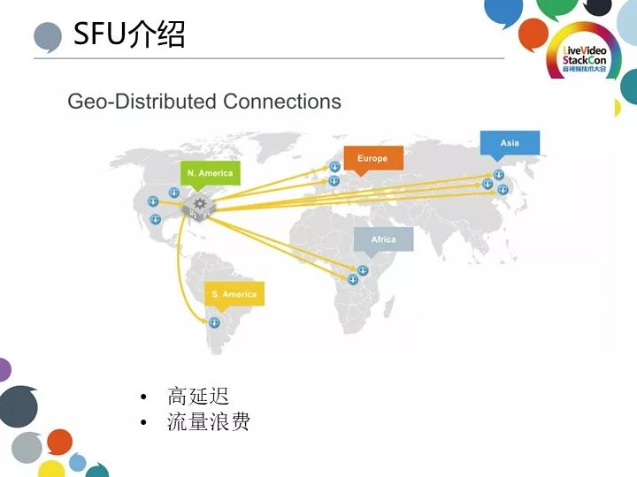
    如果将用户拓展到全球范围来看的话，那么由其造成的延迟问题就更为明显。如上图情况，学生在中国而老师在美国的话，学生看老师就会增加2倍的跨洲延迟。同时，高延迟除了造成视频的卡顿、丢包，还会造成流量的浪费。如果不解决这些问题，我们便无法部署一个性能优异的全球化分布式网络架构，那么如何解决这些问题呢？

## 解决方案：级联SFU
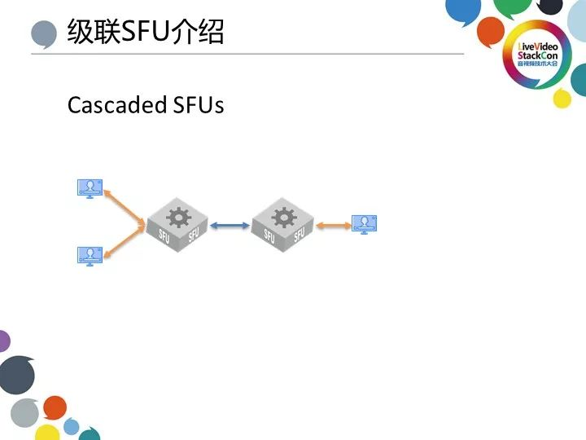

我们的思路是通过级联SFU而非单SFU解决上述问题，也就是将SFU相互级联后，使客户端发布的流经过另一个SFU转发，其它客户端再从另一个SFU订阅。

1. 解决人数限制
    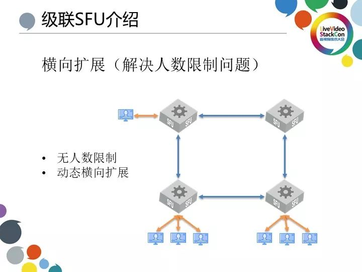

    级联SFU解决的第一项问题是人数限制，受单服务器的出口带宽所限，如果在线人数达到一定规模那么学生就无法成功订阅来自老师的视频。此时如果通过级联SFU把来自老师端的流通过下一层服务器进行转发和路由，不仅可解决人数限制的问题，还可增加动态扩展的功能，也就是根据新加入学生的人数动态扩建服务器，从而实现节省资源的目的。

2. 解决地理分布与就近接入问题
    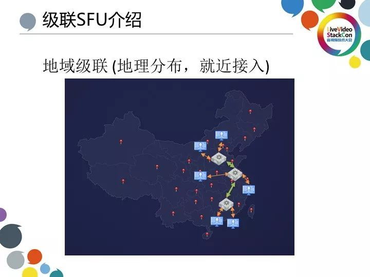

    单服务器造成的跨地域用户延迟问题，可通过级联服务器解决。通过对每位用户的IP进行解析，系统就可获知此用户所在地理位置并根据地理位置信息为用户就近分配可用服务器节点，从而尽可能降低由于地理跨度带来的视频延迟。

    
    而对于全球化来部署来说，由于一个洲所拥有的一般为一整个服务器集群，有可能此服务器集群下有多个SFU进行多层级联，这就便于我们搭建起一个简单的全球化分布式网络架构。

# Licode介绍
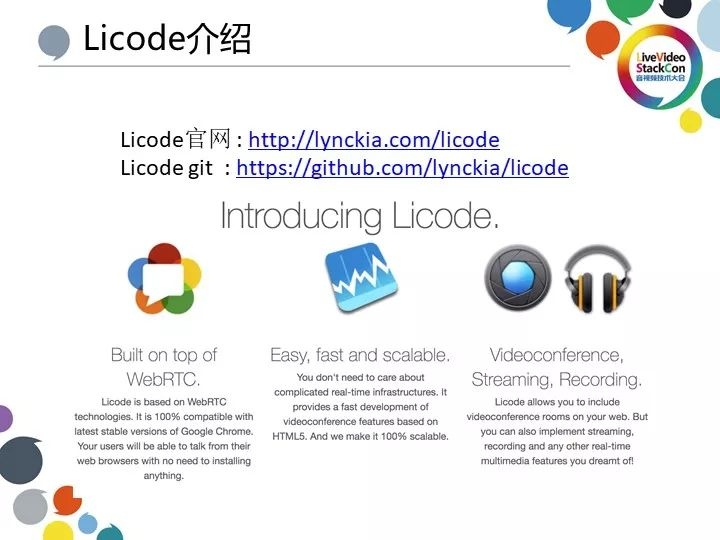

接下来我将为大家介绍Licode，上图展示的是部分Licode官方介绍。Licode相当于一个部分基于WebRTC源代码但完全兼容WebRTC的开源SFU服务器，具有简单可用易伸缩的优点，也支持视频会议，推流和录制等功能。

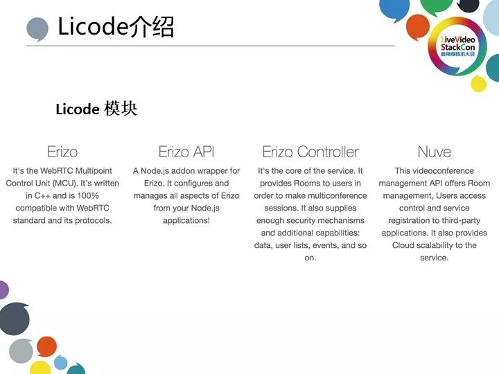

从底层到上层，我们来看一下Licode的各个模块。最底层的Erizo模块实现WebRTC的基本协议如（ICE，SDP，DTLS等），实现WebRTC协议栈后Licode就可和浏览器进行通讯并把浏览器的视频流上传至服务器；再上一层是ErizoAPI，相当于一层封装，通过NodeJS的封装层封装C++使得上层可通过NodeJS调用相应模块；ErizoAPI上一层是Erizo Controller，这部分通过JS实现的代码相当于封装下一层的调用，开发者可通过JS对其进行快速开发并实现特殊逻辑如房间逻辑、发布者逻辑、订阅者逻辑等或实现类似于（Token）验证等功能；最顶层的Nuve则主要用于通过API调用多项功能如API创建房间，API管理用户等等。

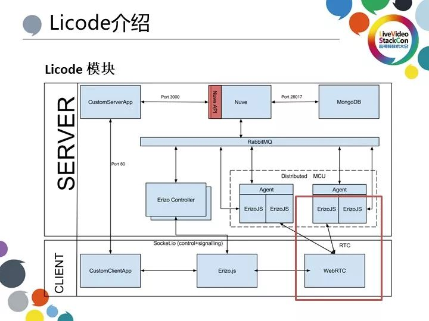

上图展示的是Licode模块的整体架构。由上至下，第一层的CustomServerApp通过创建的Port3000调用Nuve API，而数据则通过MogonDB存储；第二层的RabbitMQ会处理相应的信令并分布式；图中红框标示的部分是ErizoJS与WebRTC，此部分代码使用JS进行封装，这个模块主要封装了发布者、订阅者等逻辑。开发者可通过这里的代码直接创建一个发布者或订阅者从而实现与前端浏览器之间的通讯。

# 基于Licode级联实现
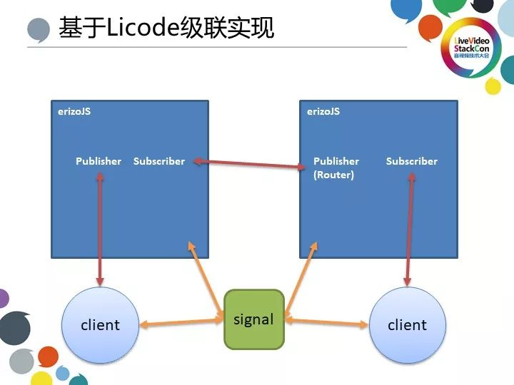

百家云将Licode ErizoJS 模块单独提取并使其直接与信令通讯，这里给大家详细描述一下流程。信令会和ErizoJS与客户端连接，信令会根据客户端的ip，给客户端选择就近的ErizoJS，同时将视频流发布至此服务器上；假若此时有一位于上海的客户端接入而视频流来自北京，那么信令就可侦测到二者不在同一区域，就会把北京的视频流推至上海的ErizoJS；与此同时，我们也会在上海的服务器端创建一个Router，此Router同样也是Publisher，上海的客户就可以使用这个Publisher 创建一个 Subscriber 来订阅视频。

1. 单节点Docker化 
    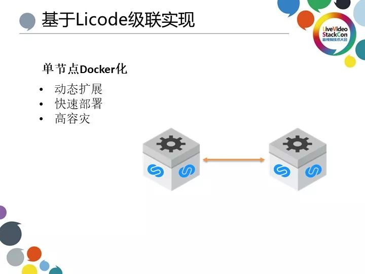

    除了实现Licode级联，百家云也对Licode部分代码进行了优化，首先是单节点Docker化。这里的ErizoJS相当于一个SFU服务器，我们所做的就是将此模块Docker化从而组成一个新的模块，此Docker化的模块可实现动态扩展、快速部署等功能。由于教育场景下，在某些时间段，如工作日晚6点至9点或周末部分时段出现流量与视频流的高并发现象，同样在凌晨时段访问量较少，一直开着一定数量的服务器并不是经济实惠的选择。Docker化之后根据需求动态调动部署服务器，既达到动态扩容的效果又节省了流量和开销，可谓两全其美。

2. 级联间去加密
    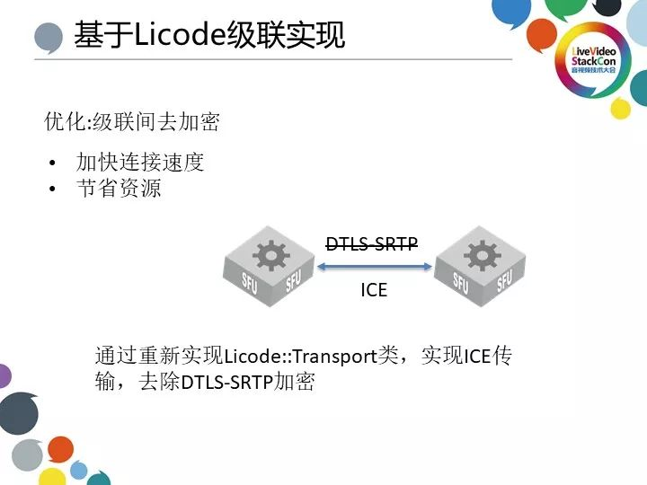

    百家云在细节上的优化也值得分享，比如说级联之间去加密。大家应该知道WebRTC本身是基于加密传输，其会实现一层DTLS SRTP加密，而此加密对于服务器和服务器直接传输来说是不必要的，因此我们取消了这一层代码并重新实现了Licode：：Transpore类，实现ICE传输。因为DTLS SRTP加密之前本身会有一个（握手）过程，如果我们去掉此加密层就会加快连接速度，同时也节省了加密计算的资源。

3. 其他级联优化
    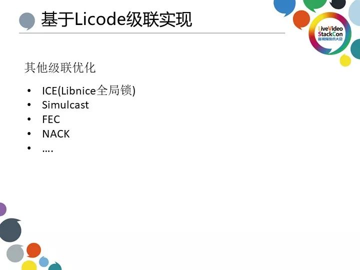

    其他的一些优化如ICE也必不可少。因为Licode基于Libnice开发，而Libnice本身存在一个全局锁问题。我们在开发的过程中发现当并发或流量达到一定高度时就会出现严重的丢包阻塞问题。我们的解决方案相是自己重新实现ICE并替换原来的Libnice数据包。除了ICE，我们还进行了Simulcast、FEC、NACK等优化。由于Licode本身是客户端与服务器之间的通信，并没有实现服务器与服务器之间的功能。我们在此基础上进行优化从而实现了服务器与服务器之间的传输。

4. 全球化
    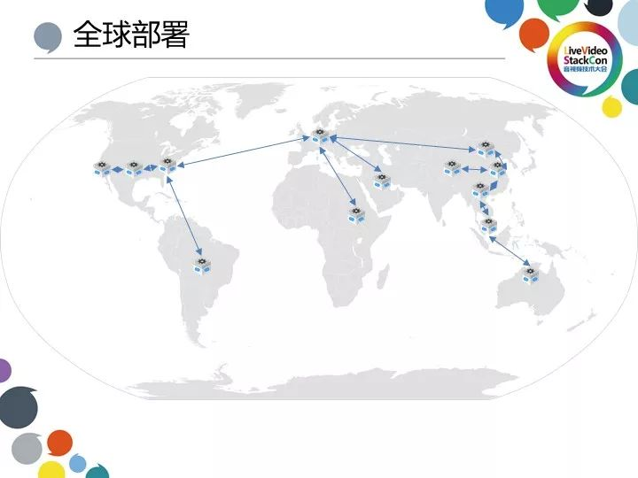

    最后我想为大家简单介绍一下教育场景全球化部署实例。我们主要针对三个区域进行全球化部署：东南亚、美国与欧洲。为了保障东南亚国家如菲律宾等的接入稳定，会选择从香港或新加坡接入，有时出于优化网络的目的还需拉专线或通过就近运营商接入优；而对于美国，由于其网络质量相对于东南亚国家更好，与中国连接的线路相对于中欧或东南亚的条件更好，所以不需要花费太多时间进行优化；中东欧国家一般通过国内常用的位于法兰克福的节点进行传输，再通过爱尔兰、英国等国家与地区接入从而尽可能优化网络质量。

# 参考
————————————————
版权声明：本文为CSDN博主「LiveVideoStack_」的原创文章，遵循 CC 4.0 BY-SA 版权协议，转载请附上原文出处链接及本声明。

原文链接：https://blog.csdn.net/vn9PLgZvnPs1522s82g/article/details/86127347

