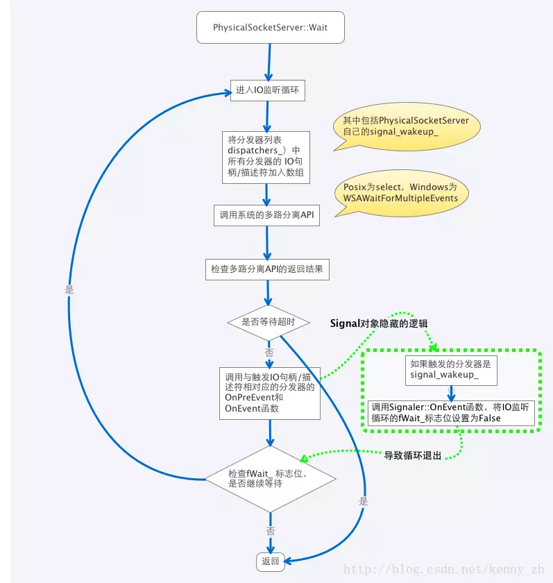
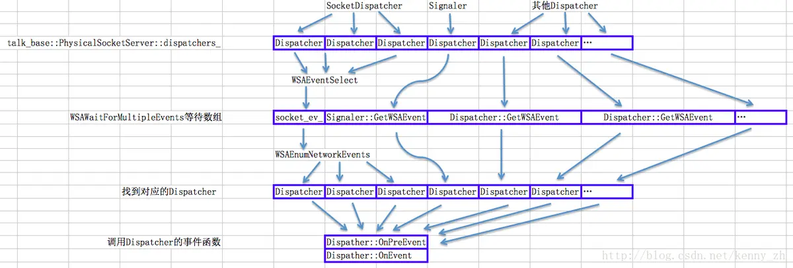

webrtc/rtc_base/physicalsocketserver.h /physicalsocketserver.cc 文件实现了一个基本的多路信号分离器。这个多路信号分离器的实现代码可以横跨 Windows、Linux、OSX、Android、ios 等平台，非常复杂。其实在 /rtc_base 目录下，还有多个 SocketServer 的实现，从这些 SocketServer 的名字就可以看出是针对哪些平台特化实现，比如MacCocoaSocketServer。在这里我就不对这些 SocketServer 进行分析，只要能够明白 PhysicalSocketServer 的原理，再加上对平台API的了解应该很容易读懂这些平台特化的 SocketServer。

在该文件中将大量使用 socket 相关的系统调用。由于本篇章的内容为多线程编程，所以尽量不做过多的涉及，并且忽略引用其他文件定义的 socket 相关类（比如 PhysicalSocket ）。

# Dispatcher
该类定义了事件分发器的纯虚基类。事件分发器主要是将 IO 或 Event 信号对应到一定的处理函数上去。该纯虚基类在 Windows 和 Posix2 个平台下定义的函数接口有很大的区别。但是主要的功能大致差不多。

# PhysicalSocket
该类是 physicalsocketserver.cc 文件的内部私有的类，不对外暴露，它主要是对 Socket 的跨平台封装。由于 Windows 也提供了基本和 BSDsocket 一致的 Socket API 所以该类的代码不难理解。

PhysicalSocket 的主要组件包括：

- s_：socket句柄/文件描述符

- enabled_events_：需要监听的IO事件

- udp_：通信方式是否为UDP

- error_：最后出错码（Last Error）

- state_：连接状态

- resolver_：异步的网址解析器

PhysicalSocket 的主要成员函数包括：


- 构造函数：创建并初始化PhysicalSocket对象

    参数说明：
    - ss：管理的SocketServer
    - s：封装的系统socket句柄/文件描述符；如果不提供该参数， PhysicalSocket 将创建一个；如果提供 PhysicalSocket 将对其进行封装

- PhysicalSocket::Create：创建系统 socket 句柄/文件描述符

    参数说明：
    - family：socket的寻址方案（AF_INET/AF_INET6）；从这个参数可以看出 WebRTC 是支持IPV6的
    - type：socket的类型（TCP/UDP）

- PhysicalSocket::Connect：连接指定的地址和端口，如果地址尚未解析，调用异步的地址解析器

    参数说明：
    - addr：需要连接的地址（使用 SocketAddress，该类包括地址和端口号）
 
- PhysicalSocket::EstimateMTU：获取socket连接的MTU（最大传输单元）

    参数说明：
    - mtu：返回最大传输单元
    - 返回值：出错码

    原理：

    Windows 平台调用 Ping 库获取

    IOS 和 OSX 平台没有简单地方法获取，直接返回出错

    Linux 平台调用 getsockopt(s_,IPPROTO_IP, IP_MTU, &value, &vlen)获取

由于 Windows 提供了基本和 BSD socket一致的 API，所以在 Windows 的代码和 Linux 的代码几乎一致。一下将简单对比一下 API：

- socket、getsocketname、getpeername、bind、connect、recv、recvfrom、accept、closesocket

    Linux 平台下完全一致

- getsockopt、setsockopt

    Linux 平台下完全一致（仅有一些特殊的选项不同）

- send、sendto

    在 Linux 平台下将最后一个参数 flag 设置为 MSG_NOSIGNAL，屏蔽 SIGPIPE

PhysicalSocket 需要注意 2 点：

虽然它继承自 AsyncSocket，但是它管理的内部系统 socket 句柄/描述符是阻塞的（它的子类 SocketDispatcher 会将系统 socket 句柄/描述符转为非阻塞的）。继承自 AsyncSocket 的原因可能是为了避免多继承造成类继承结构过于复杂。

虽然该类具有很多和 SocketServer 相关的成员变量和成员函数，但是 PhysicalSocketServer 不能直接管理PhysicalSocket。能被 PhysicalSocketServer 管理的是 PhysicalSocket 的一个子类 SocketDispatcher，它也是一个 physicalsocketserver.cc 内部私有的一个类。

当然以上这 2 点只是实现的细节问题，这些类都是不对外暴露的，我们仅仅需要懂得如何使用对外暴露的接口就可以了。

# EventDispatcher
EventDispatcher 类实现了跨平台的等价于 Win32 自动重置（ autoreset ）WSAEvent 的功能。在 Windows 平台上有网络多线程开发经验的读者应该很熟悉 WSAEvent，我就不再多做介绍了。

之前讲解过 Event 类。那 PhysicalSocketServer 还需要 EventDispatcher 来模拟 Event 呢？这是因为 Event 仅仅实现了 Win32 的 WaitForSingleObject 函数的功能，这无法应用到多路信号分离器里面去。多路信号分离器需要有能力在一个阻塞函数里等待多个 event 和 IO 信号的能力，在 Windows 平台上就是W SAWaitForMultipleEvents 函数的功能。

与之相类似的在 Linux 平台上可以使用的 API 有 select 函数，不过 select 函数只能等待 IO 信号不能等待其他 Event。这就很难实现一个阻塞函数同时等待 IO 信号和消息队列的功能。这对于网络服务器端的开发并不是非常重要，但是对于图形用户界面客户端的开发没有这个功能有时会变得很麻烦。而 EventDispatcher 的职责就是为我们模拟出这个功能。

既然 select 函数已经具有了我们需要的一半功能，怎样才能获得另一半功能呢？比较直接的方法就是将一个 event 的 signal 语义转化为 IO 信号，是的 WebRTC 就是这么做的。linux 版本的 EventDispatcher 的一个成员变量是一对管道（ pipe ）的文件描述符。如果需要 signal 一个 EventDispatcher，只要对这个管道发送一个字节（内容无所谓），就能打开 select 函数的阻塞状态。紧接着 EventDispatcher 会立即将管道内的数据读出，EventDispatcher 重新回到unsignal 的状态。这就实现了 event 的 auto reset 语义。当然，这种实现并不完美，比如说多个 select 等待在同一个EventDispatcher 上就会出问题。WebRTC 的开发人员也明白这一点，所以对 EventDispatcher 加上了以下注释：

```
// It is not possible to perfectly emulate an auto-resetting event with  
// pipes.  This simulates it byresetting before the event is handled.  
```
虽然存在以上的问题，但这并不影响 EventDispatcher 配合 PhysicalSocketServer 的工作。因为每一个EventDispatcher 实例仅隶属于一个 PhysicalSocketServer，所以不存在多个 PhysicalSocketServer 等待同一个EventDispatcher 的状况。这也可能是为什么 EventDispatcher 是 physicalsocketserver.cc 文件私有的原因。

通过上面的讲解我们应该可以理解 Linux 版的 EventDispatcher 的工作原理。以下我将 Windows 版本和 Linux 版本的API 调用做一下简单类比：

- WSACreateEvent

    pipe函数，用于创建管道

- WSACloseEvent

    close函数，用于关闭管道

- WSASetEvent

    write函数，向管道内写入一个字节数据，用以解锁阻塞的 select 函数

- WSAResetEvent

    read 函数，从管道内读出所有数据，清除管道的可读状态，下次调用 select 函数时恢复阻塞

# PosixSignalHandler
PosixSignalHandler 和 PosixSignalDispatcher 这两个类只有 Linux 版本。并且在整个 WebRTC 的源代码中没有任何地方使用过这两个类。因此，对它们的代码分析主要是为了帮助 Windows 开发人员从实用的角度学习如何使用 linux 平台下的部件。

PosixSignalHandler 类主要实现了将 Linux 的 Signal 机制纳入到多路分离器的架构中去。对于 Windows 开发人员来说，Signal 机制是一个比较陌生的东西。而且对它的处理比较麻烦。因为 Signal 会在程序运行的任何时候出现，一旦触发就会调用注册的处理函数，开发人员没法假定这时程序中哪些工具是否可用。正如在PosixSignalHandler::OnPosixSignalReceived 函数的注释中所说的在出错的时候我们甚至无法记录log：

```
// Nothing we can do here. If there's an error somehow then there's  
// nothing we can safely do from a signal handler.  
// No, we can't even safely log it.  
```
此外，Linux 的有些 signal 相关的函数在不同版本的 Linux/Unix 平台以及的表现完全不同。因为，signal 机制是一个古老的历史遗留问题，在当年 Unix 主导一切，各个大公司又各自为战的年代，要提供一个公认完备的标准确实不易。幸运的是从WebRTC 的代码来看，几乎没有什么组件使用了 signal 机制，那就说明绝大多数的现代程序都是可以不使用 signal 机制就能实现自己想要的功能的。

首先，让我们来看一下 PosixSignalHandler 类的工作原理。它被伪装成了一个 singleton，而它其实是一个全局唯一的对象，创建后永不释放，直到程序退出时内存泄露。注意，这不是开发人员不小心泄露了内存，而是主动的泄露了内存。在 WebRTC 中有一个专用的宏（ LIBJINGLE_DEFINE_STATIC_LOCAL ）用来定义定义这种类实例。如果，在程序中有限的几个类实例被设置成 LIBJINGLE_DEFINE_STATIC_LOCAL 理论上来说是没有什么负面效果的。因为它不会造成程序在运行期间不断地积累内存泄露直到拖垮整个系统。

但是使用这种手法依然需要谨慎。在使用 PosixSignalHandler 的时候，PhysicalSocketServer 会将 PosixSignalHandler::OnPosixSignalReceived 函数通过 sigaction 注册到系统以响应感兴趣 signal。当系统发出被监听的 signal 后 OnPosixSignalReceived 函数会被调用。该函数会在成员变量 received_signal_（数组）中相应的位置上设置为 true，并在 pipe 中写入 1 个字节的数据（是的，它的核心工作原理和 EventDispatcher 是一样的），这样就能解锁阻塞等待在 select 函数上的 PhysicalSocketServer。PhysicalSocketServer 通过PosixSignalHandler::IsSignalSet 函数来检查 received_signal_ 数组以确定哪个 signal 被激活，并调用相应的处理函数。

在PosixSignalHandler中主要使用的Linux API包括：

- pipe：创建管道

- fcntl：设置文件描述符的选项；该函数在构造函数中被调用，将新创建的一对pipe文件描述符设置为非阻塞。调用代码为：fcntl(afd_[0], F_SETFL, O_NONBLOCK)。不过，根据EventDispatcher构造函数的代码来看，这一步好像没有必要。考虑到EventDispatcher是一个被重度使用的对象，可以确信没有必要把pipe的文件描述符设置为非阻塞（pipe默认应该就是阻塞的，并且在绝大多数系统中IO默认都是阻塞的）。

- read：从管道读出数据，解除管道文件描述符的可读状态（该函数在PosixSignalDispatcher中使用）

- write：向管道写入数据，以解锁阻塞的select函数

- close：关闭管道

- sigaction：将signal处理函数注册到系统，当signum指定编号的signal触发时，系统会调用相应的处理函数（该函数在PhysicalSocketServer::InstallSignal中使用）

# PosixSignalDispatcher
该类也是 Linux 独有的一个类，主要是作为代表 PosixSignalHandler 的分发器，通过将该对象添加入PhysicalSocketServer 可以将实现接收 PosixSignal。它的原理已经在上一节 PosixSignalHandler 中讨论过了，这里就不再多做分析。它的主要函数如下：

- PosixSignalDispatcher::SetHandler：将signal的响应函数加入到分发器

    参数说明：
    - signum：需要响应的signal编号
    - handler：当signal触发时，响应的处理函数

# SocketDispatcher
SocketDispatcher 类主要将 PhysicalSocket 封装成一个分发器。所以，在实现上该类仅仅就是为 PhysicalSocket 添加一些 Dispatcher 接口需要的一些成员函数，以及一些状态维护代码。仅有在 Linux 版本仅有的成员函数SocketDispatcher::IsDescriptorClosed 中有些比较特殊的情况。通过这个函数中的注释我们发现尚无一些可靠的手段判断一个 socket 文件描述符是否已经被关闭，所以实现代码使用了 ::recv(s_, &ch, 1, MSG_PEEK) 来判断。在 Window 版本的 SocketDispatcher 中没有这个成员函数。除此之外，SocketDispatcher 类的 Windows 实现和 Linux 实现基本一致。以下对比一下 2 个平台 API 调用的情况：

- ioctlsocket

    fcntl函数用于设置文件描述符的选项（比如阻塞或非阻塞）

# FileDispatcher
FileDispatcher 类是一个 Linux 平台独有的类，它的功能是简单将文件描述符封装成 Dispatcher。不过它在 WebRTC 中基本上没有使用过。该类在创建的时候（构造函数中），接受并保存文件描述符，并通过 fcntl 函数将文件描述符设置为非阻塞。此外它还实现了一些 Dispatcher 接口要求的一些函数，并维护一些状态变量。该类并没有什么难点。

# Signaler
Signaler 的用处只有一个：实现 PhysicalSocketServer 的 signal_wakeup_ 成员变量（用于解除多路信号分离器的阻塞状态）。它的主要功能由父类 EventDispatcher 实现，仅仅添加了在解除多路信号分离器阻塞状态后将PhysicalSocketServer::fwait_ 成员变量设置为 false 的代码。PhysicalSocketServer::fwait_ 成员变量在被设置为 false 后，PhysicalSocketServer::Wait 函数就会退出，MessageQueue 就可以及时处理消息队列的消息。

# PhysicalSocketServer
如果说 MessageQueue 是多路信号分离器的外围，那么 PhysicalSocketServer 就是多路信号分离器的真正核心。PhysicalSocketServer 主要实现了消息和 IO 的多路分发功能，类似于 Windows 平台上的 WSAWaitForMultipleEvents 的功能。

PhysicalSocketServer 的主要成员变量包括：

- dispatchers_：分发器列表

- signal_wakeup_：中止 PhysicalSocketServer::Wait 函数的 Signaler 对象（通常在 MessageQueue 接收到事件时调用）

PhysicalSocketServer 的主要成员函数包括：

- PhysicalSocketServer::CreateSocket：创建一个Socket实例，实质为PhysicalSocket

    参数说明：
    - family：socket 的寻址方案（AF_INET/AF_INET6），说明 WebRTC 能够支持 IPv6
    - type：socket 的类型（TCP/IP）

- PhysicalSocketServer::CreateAsyncSocket：创建一个AsyncSocket实例，实质是SocketDispatcher。此外，与PhysicalSocketServer::CreateSocket函数不同的是创建后的实例立即被添加入PhysicalSocketServer的分发器列表（dispatchers_）。用户不需要在调用PhysicalSocketServer::Add函数

    参数说明：    
    - family：socket的寻址方案（AF_INET/AF_INET6），说明WebRTC能够支持IPv6
    - type：socket的类型（TCP/IP）

- PhysicalSocketServer::WrapSocket：将一个系统socket句柄/文件描述符封装成SocketDispatcher并添加入分发器列表（PhysicalSocketServer::dispatchers_）

    参数说明：
    - s：一个系统socket句柄/文件描述符，可以是同步（阻塞）的，也可以是异步（非阻塞）的。如果是同步的，该函数会通过fcntl（Linux）或ioctlsocket（Windows）转成异步的。

- PhysicalSocketServer::Add/Remove：向分发器列表添加/删除一个分发器

    参数说明：
    -pdispatcher：一个添加/删除的Dispatcher实例，PhysicalSocketServer在下一次IO监听循环中会添加/删除监听它的句柄/文件描述符。注意，是下一次监听循环，新添加的分发器不会影响当前阻塞的select（linux）函数或WSAWaitForMultipleEvents（Windows）函数。也不会唤醒当前阻塞的select（Linux）函数或WSAWaitForMultipleEvents（Windows）函数。如果开发人员需要添加/删除操作立即生效，需要自行唤醒当前阻塞的select（Linux）函数或WSAWaitForMultipleEvents（Windows）函数。


- PhysicalSocketServer::Wait：实现了多路信号分离器

    参数说明：
    - cmsWait：以毫秒为单位的等待时间，kForever表示永久等待
    - process_io：是否处理IO

PhysicalSocketServer 的核心代码就在成员函数 Wait 中。该函数比较复杂我将分几个要点来讲解：

## 大体流程
在 PhysicalSocketServer::Wait 函数中，代码的主体为 IO 监听循环。在 IO 监听循环中，Wait 函数首先将分发器列表（ PhysicalSocketServer::dispatchers_ ）中所有分发器的 IO 句柄/文件描述符加入到监听数组（需要注意的是分发器列表已经包括了 PhysicalSocketServer::signal_wakeup_，激发该分发器可以终止整个 IO 监听循环，导致 Wait 函数退出）。接着 Wait 函数就调用系统的 IO 阻塞等待函数，在 Linux 平台上为 select，在 Windows 平台上为 WSAWaitForMultipleEvents。

Wait 函数阻塞等待 IO 期间释放 CPU 资源。在阻塞等待 API 返回时，Wait 函数先检查它的返回值。如果是因为等待超时，Wait 函数将立即返回。否则，将调用被激发 IO 句柄/文件描述符的分发器的 OnPreEvent 和 OnEvent 函数。最后，检查 PhysicalSocketServer::fwait_，如果需要继续等待就再次执行 IO 监听循环，否则就退出 Wait 函数。整个函数流程如下图所示：


## 阻塞等待机制（Windows）
虽然 PhysicalSocketServer::Wait 函数在 Windows 平台和 Linux 平台上的流程大体相同，但是在实现细节上却有很大不同。首先让我们先看一下 Windows 平台。Windows 平台调用的等待 API 是 WSAWaitForMultipleEvents，该函数有能力将多个 IO 句柄使用 WSAEventSelect 函数绑定到一个 WSAEvent 句柄上去，并在等待结束后调用 WSAEnumNetworkEvents 来确定到底哪些 IO 句柄被激发。

所以， Windows 版本的 Dispatcher 定义有两个成员函数 GetSocket 和 GetWSAEvent。如果能调用 GetSocket 函数返回一个有效的 socket，那么就将这个 socket 句柄绑定到一个统一的 WSAEvent 上；如果不能返回一个有效的 socket 句柄就继续调用 GetWSAEvent，取出分发器的 WSAEvent，并把它加入到 WSAWaitForMultipleEvents 函数的等待数组中去。大致过程如下图所示：


## 阻塞等待机制（Linux）
Linux 的 PhysicalSocketServer::Wait 相对来说比较简单。它使用 select 函数等待所有从Dispatcher::GetDescriptor 返回的文件描述符。所有的文件描述符一视同仁，也没有内置特殊文件描述符。select 函数返回后调用相应的 Dispatcher 的事件响应函数 OnPreEvent 和 OnEvent。唯一比较复杂的就是 PhysicalSocketServer::signal_dispatcher_，具体的原理见 PosixSignalHandler。

## 与 MessageQueue 互动
其实，这部分内容已经在前面的章节讲述过一些了，只是比较分散。在这里我将比较全面总结一下：

整个多路信号分离器由 MessageQueue 和 PhysicalSocketServer 组成，这 2 个组件轮流获得控制权。 MessageQueue 最先获得控制权，它会检查自己的消息队列，如果有需要立即处理的消息就马上处理，如果没有就把控制权交给 PhysicalSocketServer。PhysicalSocketServer 将等待所有位于其分发器列表（PhysicalSocketServer::dispatchers_）的 IO 句柄/文件描述符。如果有 IO 句柄/文件描述符被激发，PhysicalSocketServer 将调用对应的 Dispatcher 的消息响应函数（OnPreEvent、OnEvent）。

如果在 PhysicalSocketServer 阻塞等待时 MessageQueue 接收到消息，MessageQueue 将会调用PhysicalSocketServer::WakeUp 函数激发 PhysicalSocketServer::signal_wakeup_ 以解除PhysicalSocketServer 的阻塞状态。并将 PhysicalSocketServer::fWait_ 设置为false，这将导致PhysicalSocketServer 退出 IO 监控循环重新将控制权交给 MessageQueue。MessageQueue 获得控制权后将立即处理消息，在完成消息处理后再将控制权交给 PhysicalSocketServer。

由于，PhysicalSocketServer 的实现比较复杂，因此已经无法比较 Windows 平台和 Linux 平台的代码。所以，仅仅简单罗列一下Linux平台下的API：

- select：用于对IO文件描述符数组进行轮询，阻塞等待IO信号

- FD_ZERO：用于初始化一个IO文件描述符数组的宏

- FD_SET：用于将IO文件描述符添加入由FD_ZERO初始化的IO文件描述符数组的宏

- FD_ISSET：用于检查一个IO文件描述符数组是否包括指定的IO文件描述符。由于select函数在返回时会将没有激发的IO文件描述符剔除掉，所以依然存在于数组中的IO文件描述符表示已经被激发

- FD_CLR：从IO文件描述符数组中删除一个指定的IO文件描述符

到此，我们已经完成了对整个多路信号分离器的分析。但是，这还不是 WebRTC 线程模型的全部，它还有一个重要的模块——thread，之后将对它进行分析。

作者：落冬风
链接：https://www.jianshu.com/p/664b06880851
来源：简书
著作权归作者所有。商业转载请联系作者获得授权，非商业转载请注明出处。