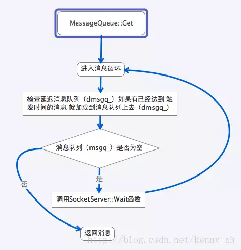

webrtc/rtc_base/messagequeue.h /messagequeue.cc 文件是多路信号分离器的重要组成部分。它实现了消息一个完整地消息队列，该队列包括立即执行消息队列、延迟执行消息队列和具有优先级的消息队列。其中，MessageQueue 类也是 Thread 类的基类。所以，所有的 WebRTC 的线程都是支持消息队列的。

# MessageQueueManager
MessageQueueManager 类是一个全局单例类。这个类看似比较复杂，但是功能其实非常简单——仅仅为了在所有的 MessagerQueue 中删除与指定的 MessageHandler 相关的消息。WebRTC 的消息队列在发送消息的时候要指定消息处理器（ MessageHandler ）。如果某个消息处理器被析构，那么与之相关的所有消息都将无法处理。所以，创建了这个全局单例类来解决这个问题（见 MessageHandler 析构函数）。

MessageQueueManager 的代码没有涉及任何跨平台的 API 调用，而且本身功能也非常简单。所以我就不讨论它如何使用 vector 管理 MessageQueue。唯一需要注意的就是 MessageQueueManager 如何保证自己在第一个 Thread 类实例化之前完成 MessageQueueManager 全局单例的实例化。这当中有个有趣的状况， MessageQueueManager 在保证了自己必然在第一条子线程被创建之前自己被实例化， MessageQueueManager::Instance 函数内部没有使用任何锁来保护 MessageQueueManager::instance_ 实例的创建。

如前面所说， MessagerQueue 是 Thread 的基类。在创建 Thread 时必然会调用 MessagerQueue 的构造函数。在 MessagerQueue 的构造函数中调用了 MessageQueueManager::Add 函数，而该函数会使用 MessageQueueManager::Instance 函数创建 MessagerQueueManager 的实例。由于 ThreadManager 保证了在创建第一个子线程之前，主线程会被包装成 Thread 对象，所以 MessageQueueManager 必然可以将主线程作为第一个 MessageQueue 对象纳入管理。

以上的描述可能比较晦涩难懂，这是因为整个流程涉及到了 Thread 和 ThreadManager 等类。而这些都是尚未讲解过他们的代码。不过即使看不明白也没关系，我会在讲解完所有相关类之后演示2段范例代码，并将范例代码的调用栈完全展开。看过范例代码后绝大多数读者都应该能够明白 MessageQueueManager 的原理。

MessageQueueManager 还有最后一个问题，那就是它什么时候被析构。 MessageQueue 的析构函数会调用 MessageQueueManager::Remove 函数，并且“理论上来说”在最后一个 MessageQueue 从队列中移除之后会析构 MessageQueueManager。既然，所有的线程都被移除，那就意味着 MessageQueueManager 实例在被 delete 时重新回到了单线程的环境，所以也没有任何锁的保护。

# MessageData相关
这一节的内容将包括 MessageData 类以及多个它的子类和几个工具函数。这些类和函数都很简单，所以就不介绍代码和原理，仅仅罗列一下它们的功能。

## MessageData
定义了基类，并将析构函数定义为虚函数。

## TypedMessageData
使用模板定义的 MessageData 的一个子类，便于扩展。

## ScopedMessageData
类似于 TypedMessageData，用于指针类型。在析构函数中，自动对该指针调用 delete。

## ScopedRefMessageData
类似于 TypedMessageData，用于引用计数的指针类型。

## WrapMessageData函数
模板函数，便于创建 TypedMessageData

## UseMessageData函数
模板函数，用于将 TypedMessageData 中的 Data 取出

## DisposeData
这是一个很特殊的消息，用以将某个对象交给消息引擎销毁。可能的用途有 2 个：

1. 有些函数不便在当前函数范围内销毁对象，见范例 HttpServer::Connection::~Connection；
2. 某对象属于某一线程，因此销毁操作应该交给所有者线程（未见范例）。WebRTC 用户不需要自行使用该类，调用 MessageQueue::Dispose 函数即可使用它的功能。

以上7个类或函数的实现非常简单，有C++使用经验的读者非常容易就能理解（标准库中就有相似的类）。

# Message相关
这一节将简单介绍一下3个类： Message、 DelayedMessage 和 MessageList。

## Message
定义了消息的基本数据结构。

## DelayedMessage
定义了延迟触发消息的数据结构。在 MessageQueue 中，延迟消息被存放在以 DelayedMessage::msTrigger_ 排序（ DelayedMessage 类定义了 operator<）的队列中。如果 2 个延迟消息的触发时间相同，响应顺序按先进先出原则。

这里我将简单介绍一下各个成员变量的用途：

- cmsDelay_：延迟多久触发消息，仅作调试使用
- msTrigger_：触发消息的时间
- num_：添加消息的时间
- msg_：消息本身
在使用延迟消息时，不需要自行构建 DelayedMessage 实例。直接调用 MessageQueue::PostDelayed 或者 MessageQueue::PostAt 函数即可。

## MessageList
消息列表，定义为 std::list< Message>

# MessageQueue
现在我们正式进入多线程篇最为激动人心的部分——多路信号分离器的消息队列组件。WebRTC 的多路型号分离器由 2 部分组成：消息队列和 SocketServer（主要实现就是 PhysicalSocketServer ）。消息队列负责接受消息，并使用消息处理器（ MessageHandler 的子类）处理消息。在处理完所有消息后，消息队列调用 SocketServer::Wait 函数阻塞等待新的IO信号。如果有新的消息进入，消息队列会调用 SocketServer::WakeUp 唤醒 SocketServer 阻塞等待。这就是消息队列和 SocketServer 协同工作的基本流程。

让我们先来看一下，消息队列的实现。消息队列的主要功能是接收和处理消息，并作为 Thread 的基类出现。

它的主要部件（成员变量）包括：

- ss_：协同工作的 SocketServer

- default_ss_：默认的 SocketServer。如果在构造的时候提供 SocketServer，那么消息队列就使用用户提供的；如果没有提供，消息队列就初始化一个 PhysicalSocketServer 并保存在 default_ss_ 上，然后赋值给 ss_。在消息队列析构的时候，如果 default_ss_ 保存有默认构造 PhysicalSocketServer，那就销毁它

- msgq_：消息队列，队列内的消息按照先进先出的原则立即执行

- dmsgq_：延迟消息队列，队列内的消息按照指定的时间延迟执行

接着，我们来看一下 MessageQueue 的主要成员函数：

- MessageQueue::Get：等待接收消息。

    参数说明：
    - pmsg：存放消息的指针，用于返回消息
    - cmsWait：等待的时间，kForever表示无限等待
    - process_io：是否要求 SocketServer处理IO信号

 
- MessageQueue::PostDelayed：发送一个延迟消息（从当前时间计算延迟处理时间）

    参数说明：

    - cmsDelay：延迟毫秒数
    - phandler：消息处理器（ MessageHandler 的子类）
    - id：消息ID
    - pdata：MessageData指针

- MessageQueue::PostAt：发送一个延迟消息（直接指定延迟处理时间）

    参数说明：
    - tstamp：消息触发的时间
    - phandler：消息处理器（ MessageHandler的子类）
    - id：消息ID
    - pdata：MessageData指针

- MessageQueue::Clear：通过指定 MessageHandler和消息ID删除消息

    参数说明：
    - phandler：指定被删除消息的 MessageHandler
    - id：指定被删除消息的ID；如果该id为MQID_ANY所有与phandler相关的消息都将被删除
    - removed：返回所有被删除消息的列表

- MessageQueue::GetDelay：从现在到下一条将要触发的延迟消息的触发时间的毫秒数（无参数）

- MessageQueue::Dispose：请求消息引擎删除一个对象（delete对象指针）

    参数说明：
    - doomed：将要被删除的对象的指针

- MessageQueue::SignalQueueDestroyed（signal slot）：通知接收者（observer）消息队列将要删除（参数无）

MessageQueue 类的核心是 MessageQueue::Get 函数。Get 函数的主循环首先检查 dmsgq_ 和 msgq_ 是否有立即需要处理的消息。如果检查到需要立即处理的消息，就马上将该消息返回。如果没有检查到需要立即处理的消息，那么线程就阻塞等待在 SocketServer::Wait 函数上。如果阻塞等待期间有新的消息进入队列或者线程需要停止退出，通过 SocketServer::WakeUp 函数唤醒被阻塞的 SocketServer::Wait 函数。从 SocketServer::Wait函数返回后， MessageQueue::Get 函数会重新检查是否有可以返回的消息，如果没有则再次阻塞等待在 SocketServer::Wait 函数上。以上流程如下图所示：

MessageQueue 的原理大致如此。

# 补充说明
1. MessageQueue只是利用了SocketServer的Wait和Wakeup功能来实现跨平台异步消息队列的通知机制，MessageQueue中的Message只包含你通过post，delaypost，send，involvk添加的消息，不包括socket io事件，想要处理socket io事件需要调用socketserver的Add(Dispatcher* dispatcher)来增加处理函数。

作者：落冬风
链接：https://www.jianshu.com/p/b8a9a55e4f37
来源：简书
著作权归作者所有。商业转载请联系作者获得授权，非商业转载请注明出处。