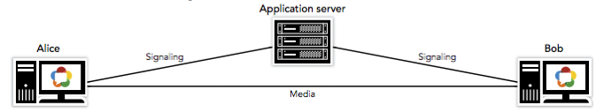
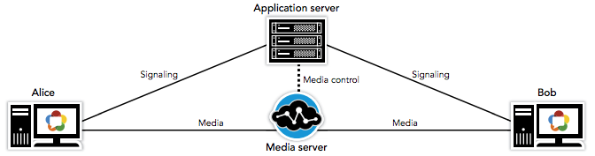
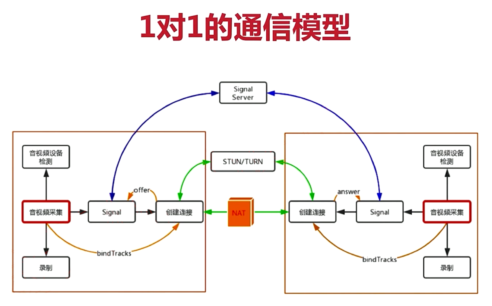
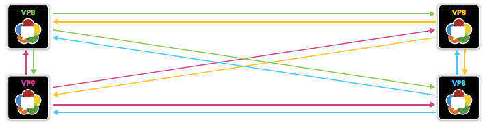
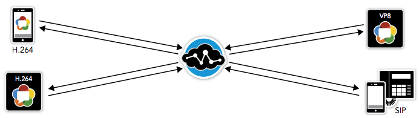
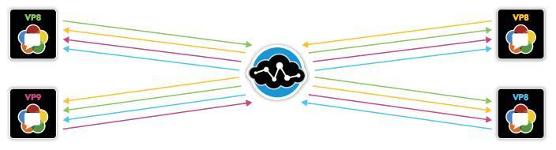

# WebRTC基础结构介绍
自从Google于2011年发布WebRTC以来，WebRTC一直是一个能够将互联网浏览器转换为强大的多媒体引擎的颠覆性技术。 WebRTC汇集了先进的实时通信技术，包括：先进的音视频编解码器（Opus和VP8/9），强制加密协议（SRTP和DTLS）和网络地址转换器（ICE＆STUN）。

根据最初的定义，WebRTC被指定为P2P（peer-to-peer）技术。自成立以来，WebRTC已经大大降低了Web开发人员通过简单的Java API构建实时通信应用程序的难度。但要清楚，WebRTC是一种技术，而不是一个完整的应用程序或服务。

虽然WebRTC最初被设想为纯粹的P2P技术，但许多日常业务应用程序需要集中式媒体功能，通过P2S（peer-to-server）架构提高可靠性、效率或扩展性。对于P2P和P2S架构之间的问题对于构建WebRTC应用程序很重要。

# P2P到P2S
WebRTC旨在通过其浏览器（也称为P2P）在客户端之间直接发送媒体流。在P2P架构中，客户端建立通信之前，首先需要建立到应用服务器（有时也成为信令服务器）的信令连接。而 WebRTC规范中没有规定信令方法或协议，它允许采用现有方法（SIP，WebSockets，XMPP等）或实现专有信令过程。应用服务器保存业务逻辑，并作为会话描述协议（SDP）交换的中介。一旦SDP交换完成，两个客户端之间的直接媒体通信即可开始。

虽然WebRTC主要是浏览器到浏览器，但是随着服务器将媒体锚定在网络中以充当媒体P2S（如下图）。在P2S架构中，客户端再次建立到应用服务器的信令连接。在该体系结构中，应用服务器继续管理业务逻辑，而且还利用到服务器的媒体控制连接来进行客户端和媒体服务器之间的SDP交换。一旦SDP交换完成，客户端和服务器之间的媒体通信即可开始。

使用服务器端处理可以引入高级功能，例如用于合规性的集中审查，音频/视频回放，用于视频流的媒体分析，从而实现人脸监测、人脸识别等。根据架构，服务器端处理可以优化带宽并最大限度地减少客户端计算，从而能够使移动客户延长电池使用时间，并为其提供灵活的用户界面。

对于支持多个参与者（会议，远程学习，联络中心）的更复杂的应用程序，主要有三个WebRTC的网络结构：
- P2P Mesh
- MCU（Multi-point Control Unit）
- SFU（Selective Forwarding Unit）

# webrtc P2P
在分享webrtc服务器模型之前，先看一下webrtc中1对1的通信模型，后面的webrtc服务器模型中每一条连线都做了1对1的通信模型中的这些事：

首先webrtc提供了音视频设备检测，音视频采集等能力，我们可以轻松得到音视频流；signal信令需要我们和信令服务器通信，自己实现一些业务逻辑；在真正建立连接的时候，还需要通过STUN/TURN服务器来穿透NAT建立连接，这块连接建立和音视频传输的能力也是webrtc提供的，我们需要指定STUN/TURN服务器即可。

# 三种WebRCT网络结构

## Mesh
音视频数据流只在终端用户之间相互传输，不经过任何服务器节点，而且每个人都要与其它所有人建立P2P连接。

每一个P2P连接有独立的传输策略控制，通讯质量有一定的保障（但是国内P2P连通率发现并不是那么理想）。但是，这种架构对于客户端系统是一种浪费，一方面需要分配更多的端口，消耗更多的系统资源；另一方面，由于要向其它三个客户端发送本地音视频数据，增加了上行网络带宽的消耗，在同等带宽条件下，支持的多人通话路数就相对有限，视频质量(码率)也比较低。

在多人视频场景下，Mesh方案的瓶颈是客户端性能和带宽，随着视频人数的增加，客户端每次要多发送/接收两路流（音/视频），一般能达到10人视频就不错了。所以这个方案会提高客户端所支持的最低配置的下限。

## MCU
MCU是传统视频会议系统中的核心控制单元，在WebRTC的系统实现中， 适合于多人音视频通话场景，MCU可以对接收到的多路流进行转码和混合，并向每个终端输出单路流。

MCU将接收到的多路流进行转码和混合，并向每个终端输出单路流的做法，节省了终端用户的下行带宽，并且还能够对不同网络条件的用户，订制不同码率的输出视频流，让多人场景有更好的用户体验。它的缺点也显而易见，随着视频人数的增加，服务器进行多路流的转码和混合将消耗很大的cpu和gpu，即使是使用gpu硬解来转码混合，一台服务器所支持的同时视频人数也不会太高；而且服务端进行混流的话，多人视频显示的布局就由服务器决定了，混合完是什么样，客户端播放就是什么样，没法自由调整每一路视频的显示布局和分辨率。

在多人视频场景下，MCU方案的瓶颈是服务器性能，目前还没有好的办法来解决。

## SFU
SFU从发布客户端复制音视频流的信息，然后分发到多个订阅客户端。

SFU是解决服务器性能问题的有吸引力的方法，因为它不涉及视频解码和编码的计算费用，它以最低的开销来转发各路媒体流。但是随着视频人数的增加，服务端的下行带宽会不断增加，但是现在有很好的解决方法，例如simulcast,svc等等。

虽然SFU也有缺点，但是已经有了成熟的解决方案，所以SFU是目前视频会议主流的解决方案，思科，zoom，lark都是采用的SFU的方式。